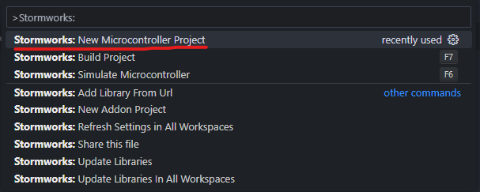
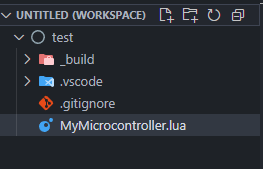
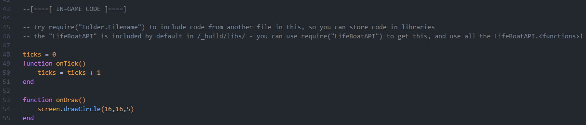
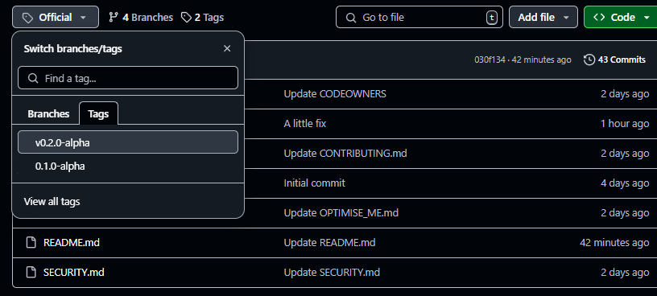
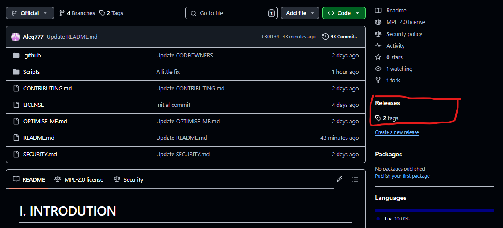

!! Branches !!
==============

I recommend downloading files from `Tags`, where you can select the version.
**Latest** is the newest release.
**Recommended** is a version that has the least known bugs/is considered the best to use for now.
**Newest** is the newest version in general (alpha, beta, rc). It may contain bugs, it may change alot. Testing this version will really help developing QUI.

About __Branches__:
- `Official` contains **latest** version
- `Recommended` contains **recommended** version
- `Newest` contains **newest** version
- other - useless, don't use them

# I. INTRODUTION

Hello, everyone!
This is QUI library. I have created it to make easier coding an interactive and dynamic UI for Lua monitors.
It has many possibilites - and they can be easily extended too.

Read this document - it may be helpful.

> [!TIP]
> Join [QUI Discord server](https://discord.gg/zjjqBnx6xu) for help and faster contact with me and Contributors

In this document:
- [About QUI](#about)
- [QUI Discord server](#discord)
- [Bugs and issues](#bugs)
- [Contribute](#contribute)
- [Include QUI in your Project](#include)
  - [IDE](#ide)
    - [How to use VSC + LifeBoatAPI](#vsc)
  - [Adding QUI library](#add)
    - [Base QUI file](#base)
    - [Adding Templates](#addt)
    - [Adding Extensions](#adde)
    - [Other IDE's](#addi)
- [Using QUI](#using)
  - [Simple project](#simple)
  - [Templates and Objects concept](#tao)
    - [Templates](#ct)
    - [Objects](#co)
  - [Examples](#examples)
    - [Steam Workshop](#ws)
    - [Code examples](#code)
- [Templates](#templates)
  - [Official Templates](#to)
  - [Community Templates](#tc)
  - [Custom Template](#tcustom)
- [Extensions](#extensions)
  - [Official Extensions](#eo)
  - [Community Extensions](#ec)
  - [Custom Extension](#ecustom)
- [Other](#other)
  - [Policy](#policy)

## <a name="about"></a> About QUI

**Who can use QUI?** - everyone!
- For beginners, it offers a really easy functions to draw basic elements. It may help with learning concepts of Stormworks monitors and Lua.
- For experienced programmers, it offers a lot of functions to create advanced UI faster, without need to write your own library of functions

QUI gives the possibilities to:
- Code UI **much easier**
- Create **interactive UI** (e.g. for vehicle menu)
- Dynamically display elements - repetitive and moving elements are much easier to do

## <a name="discord"></a> Discord

LINK

- Fast and convenient way to contact me and other programmers
- You can get help with learning, how to use QUI, how to improve your code etc.
- If you become a Contributor, you will have the possibility to announce changes in your Packs.

## <a name="bugs"></a> Bugs and issues

Remember to check, if you are doing everything correctly. Often small mistakes cause big problems.
- Check, if you connected properly files with your project.
- Check, if you use functions properly.
- Check the connections between Microcontroller (and inside) and monitor (and if it's on and has electricity source).

If you are unsure if that's a bug - you should report that too.

You can report the bug:
- [SECURITY.md](https://github.com/Aleq777/Stormworks-QUI/blob/Official/SECURITY.md)

## <a name="contribute"></a> Contribution

If you get to know well with the QUI library and want to contribute - read [CONTRIBUTTING.md](https://github.com/Aleq777/Stormworks-QUI/blob/Official/CONTRIBUTING.md)

# <a name="include"></a> II. INCLUDE QUI IN THE PROJECT

## <a name="ide"></a> IDE

> [!TIP]
> When creating a Lua project for Stormworks microcontroller, you should always use an IDE or Text Editor.
> It's easier, faster and more conveniet.

The easiest way to create UI is using [Visual Studio Code](https://code.visualstudio.com) with those extensions:
- With this extension: [LifeBoatAPI](https://marketplace.visualstudio.com/items?itemName=NameousChangey.lifeboatapi)
- Lua: [Lua Debug](https://marketplace.visualstudio.com/items?itemName=actboy168.lua-debug)
> [!WARNING]
> LifeBoatAPi doesn't support newest version of `Lua Debug`. Press `Install specific version ...` and select `1.61.0` or `1.60.4`
- [Lua Language Server](https://marketplace.visualstudio.com/items?itemName=sumneko.lua) (for annotations `---@` - they help a lot)


> [!NOTE]
> If you are using different IDE, you will need to manually copy, paste and remove some parts of code.
> You will must use a Lua code minifier too.
> See [OPTIMISE_ME.md](https://github.com/Aleq777/Stormworks-QUI/blob/Official/OPTIMISE_ME.md) for manual optimalisation.

### <a name="vsc"></a> How to use VSC + LifeBoatAPI

1. After installing VSC and LifeBoatAPI extension, press `Ctrl + Shift + P` or `Ctrl + P` in VSC and search for `>Stormworks: New microcontroller project`


2. Select project's location. After that, your project's files should look like this:


3. You can configure Microcontroller Simulation here, but you don't need to as it's already preconfigured


4. Head down to `[ IN-GAME CODE ]` part. Here, you can write the microcontroller's script.


5. By pressing `F6`, you start the simulation. When you're ready, you can minify your code by pressing `F7` and then copy the file's content in `_build/out/release/MyMicrocontroller.lua` (or other file name).
> [!WARNING]
> LifeBoatAPI, even considered as the best SW monitor simulator, has sometimes different outputs. Compare the Simulator's output and in-game monitor from time to time.
6. To use QUI, install the library (or specific files) and paste them in your microcontroller's project (the best practice is to paste them inside a folder, like `QUI`). Include QUI by `require` function. [More](#add)


## <a name="add"></a> Adding QUI to your project

1. Select the QUI version.

or


2. Download the files and install them inside your project's files (best in a dedicated folder).
3. Include any file using `require` function
```lua
require ('QUI.Base') -- In case the location is QUI/Base.lua
```

### <a name="base"></a> Base file

Base file `Base.lua` is the most important file of QUI library if you want to use it for User Interfaces. [Other QUI purposes](#adde)

```lua
require ('QUI.Base') -- In case the location is QUI/Base.lua
```

### <a name="addt"></a> Adding Special Templates

There are 2 types of Templates:
- **Official Templates** (`Templates/`) - made by QUI devs, 100% compatible and up to date.
- **Community Templates** (`Community Templates/`) - made by Contributors, reviewed by QUI devs before adding to the QUI repository. [Become a Contributor](https://github.com/Aleq777/Stormworks-QUI/blob/Official/CONTRIBUTING.md)

You can add them by:
```lua
require ('Templates.Title') -- for Official Templates
require ('Community Templates.Car Dashboard') -- for Community Templates
```

### <a name="adde"></a> Adding Extensions

> [!TIP]
> Some of the QUI Extensions may be not connected to the QUI at all. If you need something for non-monitor-projects, you can look up there and see if there's something for you.
> Example: `Extensions/Time` - you can use it for programming machines etc.

There are 2 types of Extensions, too:
- **Official Extensions** (`Extensions/`) - made by QUI devs, fully compatible with base QUI functionalities.
- **Community Extensions** (`Community Extensions/`) - made by Contributors, reviewed by QUI devs. [Become a Contributor](https://github.com/Aleq777/Stormworks-QUI/blob/Official/CONTRIBUTING.md)

You can add them by:
```lua
require ('Extensions.Time') -- for Official Extensions
require ('Community Extensions.3D') -- for Community Extensions
```

### <a name="addi"></a> Other IDE's

There are many IDE's with different supports for Lua/Stormworks. In case your IDE doesn't support `require` properly - you **must** paste the files' contents manually.

> [!NOTE]
> If your IDE doesn't support `---@section` annotation - see [OPTIMISE_ME.md](https://github.com/Aleq777/Stormworks-QUI/blob/Official/OPTIMISE_ME.md)


# <a name="using"></a> III. USING QUI

QUI doesn't work in the same way as basic Stormworks Lua, but it can in some cases. Read this chapter to understand QUI's concept of drawing.

## <a name="simple"></a> Simple Project (beginners)

> [!TIP]
> If you are a programmer beginner, learn basic [Lua](https://www.lua.org/docs.html) - it will help you a lot. Don't worry - it's an easy language.
> If you are a Stormworks beginner, use `Draw*` functions from `QUI`, they will help you understand Stormworks Lua.

1. Draw a straight line
```lua
require ('QUI/Base')

function onTick()
    -- not needed now
end

function onDraw()
    DrawLine(1, 10,
        10, 0) -- Draws a white line from (1, 10) to (11, 10) 
end
```

2. Draw a rectangle
```lua
require ('QUI/Base')

function onTick()
    -- still, not needed
end

function onDraw()
    DrawBox(1, 1,
        10, 10, Style(nil, RED)) -- Draws a red rectangle at (1, 1) with 10 width and 10 height (pixels)
end
```

3. Draw a text
```lua
require ('QUI.Base')

function onTick()
    -- How's your day?
end

function onDraw()
    DrawText(1, 1,
        "Hello world!") -- Draws a "Hello world!" on (1, 1)
end
```

## <a name="tao"></a> `Templates` and `Objects` concept

Think of Templates and Objects as of class and instance.

- `Template` is an element type to display. It has properties and behavior, but they're not known yet. (Example: A rectangle. It has width, height, border and fill color)
- `Object` is a Template's instance. It has defined properties and it's ready to be drawn. (Example: A red rectangle with blue border, is 10 px wide and 5 px tall)

This gives the possibility to draw multiple times the same thing easily, copy it's properties and improve readability.

> [!TIP]
> Use Templates and Objects when you need to control properties, copy them or draw them multiple times. In other case, use `Draw*` functions for best optimalisation.

### <a name="ct"></a> `Templates`

Templates are defined in:
- `Templates` table of behaviors
- `TEMPLATE_NAME` function, which sets it's properties (it's a state between Template and Object before returning)

Templates define, how the object must be drawn for each given position and properties.

Template example:
```lua
-- fragment of Base.lua - QUI v0.3.0-beta
Templates["Line"] = function (x, y, obj)
    -- x and y are the position, where to draw the line (Object)
    -- obj contains all the properties of Line
    SetColor(obj.Color) -- The Line has a property of Color
    screen.drawLine(x, y, obj.X + x, obj.Y + y) -- That's a tricky one. QUI uses vectors, not static positions.
    -- So, obj.X and obj.Y are a VECTOR of the line that can be drawn at (x, y)
end


-- x and y are the VECTOR of the line
-- color is the color of the line
-- isAnon decides, if the object should be referenced or returned (default = false - so it's referenced)
function Line(x, y, color, isAnon) end
-- this function is a shorter Object function


-- This function draws a line.
-- CAUTION! It's still a vector!
-- So, it draws a line from (x, y) to (x,y)+(x2,y2)
function DrawLine(x, y, x2, y2, color) end
```

### <a name="co"></a> `Objects`

Objects are partially defined in `TEMPLATE_NAME` function (example: `Line`). You don't use objects unless you use this function.

Objects can be anonymous. Read further to understand that concept.

Object example:
```lua
local square = Box(5, 5, Style(nil, WHITE)) -- non-anonymous Object, reference
PropertiesOf(square).Params.Width = 10 -- it has a width of 10 now

function onDraw()
    Draw(1, 1, -- draw at (1, 1)
        square) -- it's not a square because it's 10x5, it's a rectangle!
end
```

Anonymous object is an object that is not referenced (in fact, it is, but in other way).
Example:
```lua
local square = Box(5, 5, Style(nil, WHITE), true) -- anonymous Object, not referenced to Objects table
square.Params.Width = 10

function onDraw()
    Draw(1, 1, -- draw at (1, 1)
        square) -- it's not a square... again, 10x5
end
```

So:
- **Anonymous Object** is an Object that depends on the variable. If variable gets deleted, the object too
- **Non-anymous Object** is an Object that is independant. The variable may be deleted, but not the object. It's like a C++ pointer.

**When to use anon and non-anon?**
In most cases, there's no much difference. If you are doing an UI with pages (like a website), you should consider that question:
- Non-anons are ALWAYS existing until you delete them (read further for manual deleting). If your Object has a lot of properties, it's better to have it exist always, so Lua doesn't need to reallocate "the same object" multiple times
- Anons are existing when a variable exists. Use them for smaller objects for a proper memory managment.

Like I said, it's like C++ pointers. If you know them - this shouldn't be a problem for you ;)
**In other case, stick to one type**. Probably you'll want the anonymous ones.

**Deleting non-anons**
```lua

local nonAnon = Box(5, 5, Style(nil, RED))

-- do something fancy

Objects[nonAnon] = nil -- deletes the object

-- stop using nonAnon or assign to it a new object
nonAnon = Text(1, 1, "I'll probably stick to anonymous, too many sweats")
```

## <a name="examples"></a> Examples

Now, time for bigger examples.

### <a name="ws"></a> Workshop UIs with QUI

- [Car Dashboard]()
- [Simple Webpage]()
- [Simple calculator]()

### <a name="code"></a> Code examples

We consider the [Simple Webpage](). It uses [Base.lua](https://github.com/Aleq777/Stormworks-QUI/blob/Official/Scripts/Base.lua), [Extensions/Webpage.lua](), [Templates/Interactives/Button.lua]()

```lua
require ('QUI.Base')
require ('QUI.Extensions.Webpage')
require ('QUI.Templates.Interactives.Button')


function onTick()

end

function onDraw()

end
```

# <a name="templates"></a> IV. COMMUNITY CONTRIBUTIONS

> [!IMPORTANT]
> Sometimes, we will contact you to join push your Community Template to Official Templates, co-work for Official Template or make our version of that Template.


# <a name="other"></a> VI. OTHER

## <a name="policy"></a> Policy

### Version Support

> [!TIP]
> See [SECURITY.md](https://github.com/Aleq777/Stormworks-QUI/blob/Official/SECURITY.md) for version support

As of the Stormworks Lua doesn't need to be secured, version support has a different meaning.

Version support meaning:
- ✅ - QUI Team will help you with your code, will listen to your suggestions about this version and new Templates and Extensions will be compatible with those versions. Often `Newest`, `Recommended` and `Newest Beta` will be supported.
- 🟨 - QUI Team will help you with your code, new Templates and Extensions may (but not need to) be compatible with those versions.
- ❌ - This version is outdated, you should move to the newest stable version.

### Contributions

- For Templates and Extensions - we will make sure that you will be mentioned as an author, even if we move your contribution to Officials.<br>
- For improving QUI code - we will mention you in the release description.

### Help and issues


### Fixing QUI code

If you see a bug in/possibility to improve QUI base code / Official Template / Official Extension, contact us, make a contribution (PR) of those files.

## Become QUI Dev

At this point - I'm not searching for other devs. But if you have idea how to develop QUI, you are experienced and willing to help with development process - I'll be happy to see you as my partner.